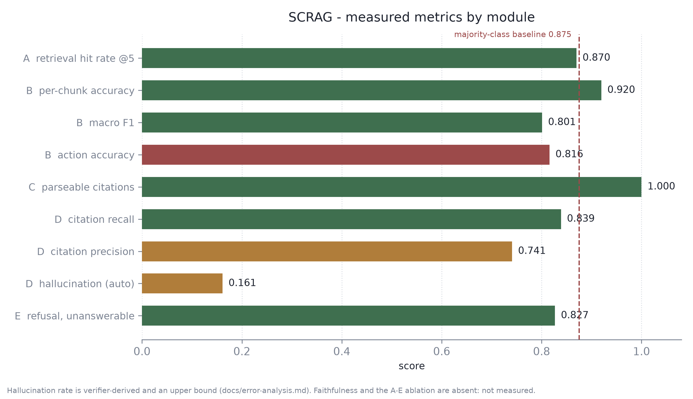

# SCRAG

**A self-correcting, citation-verified RAG framework for reliable answers.**

A document-QA system that answers only from retrieved sources and refuses any claim it cannot back
with a **verified** citation.

---

## The problem

Retrieval-augmented generation fails in two distinct ways, and conflating them is why "add
citations" does not fix hallucination.

| Failure | What it looks like | Closed by |
|---|---|---|
| **Ungrounded claim** | states a fact that is not in the retrieved sources | retrieval gating (**B**) + abstention (**E**) |
| **Unsupported citation** | attaches a citation that *looks* valid but does not support the sentence | citation forcing (**C**) + NLI verification (**D**) |

The second is the more dangerous, because a citation is a claim of support. A wrong one makes an
unverified sentence look checked.

This project measures the two separately at every stage. The gap is real and measurable: a
word-overlap check scores our citations at **0.9963**, while entailment scores citation precision at
**0.7409**. Roughly a quarter of individual citations do not support the sentence they are attached
to — and only the second number can see it.

## The architecture

```
question → [A] retrieve → [B] grade ──(all wrong)──→ abstain, free
                              │
                     (ambiguous) └──→ corrective retrieval ──┐
                              │        (bounded, loop 1)  ───┘
                              ▼
                        [C] generate with one citation per sentence
                              ▼
                        [D] verify each citation by entailment
                              ▼
                        [E] repair once → re-verify (loop 2) → drop → or abstain
                              ▼
                    answer, every sentence cited and verified
```

Full diagram with both loops: **[docs/architecture.md](docs/architecture.md)**.

Everything except generation runs locally on CPU. Verification is therefore free, so there is no
incentive to check less — and an abstention triggered by Module B costs nothing at all, because the
pipeline stops before the paid component is reached.

| Module | File | Role |
|---|---|---|
| A | `core/retriever.py` | chunk, embed, FAISS retrieval |
| B | `core/evaluator.py` | grade chunks; trigger corrective retrieval |
| C | `core/generator.py` | generate with one citation per sentence |
| D | `core/verifier.py` | entailment-check every citation |
| E | `core/repair.py` | repair, drop, or abstain |
| — | `core/orchestrator.py` | wires A–E; flags drive the ablation |

## Results

Every number below came from a run recorded in `eval/results/`. Full table with sources:
**[docs/tables/measured_results.md](docs/tables/measured_results.md)**.



| Module | Metric | Value |
|---|---|---|
| A | retrieval hit rate @ k=5 | **0.8700** |
| B | per-chunk grading accuracy | **0.9197** (macro-F1 0.8010) |
| B | query-level action accuracy | 0.8158 — *below* the 0.8750 majority baseline |
| C | parseable-citation rate | **1.0000** (397/397 sentences), invalid-id rate **0.0000** |
| D | citation recall / precision | **0.8388** / **0.7409** |
| D | hallucination rate (auto) | 0.1612 — an **upper bound** |
| E | refusal on unanswerable questions | **0.8267**, before generation, free |
| — | cost per question | **$0.01089** measured |
| — | tests | 165 passing |

### Paper reported X vs we achieved Y

| Concern | Paper | Reported | Source | We achieved |
|---|---|---|---|---|
| Evaluator action accuracy | CRAG (Yan et al. 2024) | 0.8430 | Table 4, arXiv:2401.15884v3 | **0.8158** |
| Citation precision | ALCE (Gao et al. 2023) | *not recorded* | — | 0.7409 |
| Citation recall | ALCE (Gao et al. 2023) | *not recorded* | — | 0.8388 |
| Faithfulness | — | n/a | — | *not measured* |

Empty cells are deliberate. A baseline figure without a paper **and** a table behind it is left
blank rather than filled with a plausible number.

## What is not finished

Stated plainly, because a build log full of unqualified numbers would undercut a project whose
entire argument is that systems should not assert what they cannot support.

- **The A–E ablation table does not exist.** The harness runs from one command
  (`eval/run_ablation.py`), but the sweep needs generation across five variants and the API credit
  balance was exhausted. No cell has been estimated.
- **Faithfulness has never been measured.** The Phase 1 baseline never ran, for the same reason.
- **Module B does not beat its baseline.** 0.8158 against CRAG's 0.8430 — and below our own
  majority-class baseline of 0.8750, which means clearing 0.8430 on this split would not have been a
  real claim either. This is a finding, not a pending task.
- **No public URL.** The Docker image builds and runs (3.6 GB, verified); deploying needs an
  account. See [DEPLOY.md](DEPLOY.md).
- **CI has not run on GitHub.** The gate is proven locally five ways, including a real regression;
  that GitHub's runner invokes it is not yet proven. See [CI.md](CI.md).

## Limitations

**Labeling-scheme subjectivity.** Module B's grading accuracy is scored against a rubric this
project defines (`train/LABELING.md`), frozen before any labeling. CRAG never published a per-chunk
rubric, so the per-chunk numbers have no published counterpart in either direction. The
`ambiguous` class is the weakest at F1 0.588 — expected, and the reason the rubric spends most of
its worked examples on that boundary.

**The hand-labeled sets do not exist.** Three numbers rest on rules rather than people: Module B's
training labels are rule-derived (`train/weak_labels.py`), Module D's calibration positives are
*lexically* verified rather than human-verified, and the hallucination set
(`eval/LABELING_HALLUCINATION.md`) is frozen but unlabeled. The tooling for all three is built
(`train/label.py`, `train/agreement.py`) and unused. This is the single largest gap between what the
project claims and what it has evidence for.

**Single-checkpoint NLI verification.** Module D is one model, and the error analysis shows it is
the dominant error source — most flagged sentences are verifier mistakes, not generator mistakes.
It also inherits a 512-token premise window, which silently truncates long ALCE passages. An
ensemble, or AlignScore alongside it, would bound this.

**The `concat` multi-citation policy dilutes entailment.** Measured: 11 of 23 multi-citation
failures are cases where the best single citation would have passed. One sentence scores 0.998
against its supporting passage and 0.075 once a second passage is appended. Documented with a fix
in [docs/error-analysis.md](docs/error-analysis.md); not silently changed.

**Module B does not transfer off its training distribution.** On the four demo policy documents it
grades almost everything `ambiguous`, and returns `correct` at confidence 0.52 for
"Who is the Vice-Chancellor?" — a fact those documents never mention. The abstention guarantee still
holds there, but via Modules C/D/E, so it costs a generation call instead of being free.

**Demo-corpus narrowness.** Four short policy documents, 8 chunks. Enough to demonstrate refusal and
citation, not enough to evaluate anything.

**Free-tier and model constraints.** Everything is CPU-only; the single GPU job (the Module B
fine-tune) ran 86 minutes on CPU instead. The generator is the one paid dependency, and running out
of credit is what left four gates open.

## Setup

Python **3.11** — faiss / torch wheels are not dependable on 3.13+.

```bash
py -3.11 -m venv .venv
.venv/Scripts/activate          # source .venv/bin/activate on Unix
pip install -r requirements.txt
cp .env.example .env            # then add a real ANTHROPIC_API_KEY
```

```bash
python -m eval.build_index --split dev --limit 200   # free: builds the corpus and index
uvicorn app.api:app --reload                          # terminal 1
streamlit run app/ui.py                               # terminal 2
```

Then **Load demo corpus** in the sidebar. Rehearsed walkthrough: **[docs/DEMO_SCRIPT.md](docs/DEMO_SCRIPT.md)**.

With Docker:

```bash
docker compose up --build       # API on :8000, UI on :8501
```

## Ingest capacity

| Limit | Value |
|---|---|
| Bytes per file | 150 MB |
| Files per request | 50 |
| Bytes per request | 2 GB |

**Chunking is not the bottleneck.** 47 MB of text splits into 69,335 chunks in **0.18 s**; embedding
them takes **~26 min** on a 6-core CPU. Embedding cost scales with *tokens*, so coarser chunks
(`?bulk=true`) give only ~1.2×, not the 2.6× the chunk count suggests.

At the measured 45 chunks/s, **1.5 minutes buys about 4,000 chunks — roughly 2 documents of 500
pages.** For 25 × 500 pages in that budget you need a GPU: `config.RETRIEVAL.device` is `"auto"`
and selects CUDA when present, no code change.

Re-ingesting a document is now **57.8× faster** — vectors are persisted, so replacing one file no
longer re-embeds the whole corpus.

Full measurements, including what was tried and rejected: **[docs/INGEST_CAPACITY.md](docs/INGEST_CAPACITY.md)**.

## Documentation

| Document | Contents |
|---|---|
| [docs/architecture.md](docs/architecture.md) | pipeline diagram, both corrective loops, type contracts |
| [docs/error-analysis.md](docs/error-analysis.md) | twenty real failures with commentary |
| [docs/REPRODUCIBILITY.md](docs/REPRODUCIBILITY.md) | seeds, versions, hardware, every run command |
| [docs/DEMO_SCRIPT.md](docs/DEMO_SCRIPT.md) | rehearsed demo, with the abstention trigger named |
| [docs/tables/](docs/tables/) | all measured results, CSV and markdown |
| [DEPLOY.md](DEPLOY.md) | Docker, HF Spaces, Render |
| [CI.md](CI.md) | the regression gate and how to fire it |
| [docs/INGEST_CAPACITY.md](docs/INGEST_CAPACITY.md) | measured ingest throughput, limits, and the GPU path |
| `train/LABELING.md` | the frozen chunk-grading rubric |
| `eval/LABELING_HALLUCINATION.md` | the frozen hallucination rubric |

## Stack

sentence-transformers (bge-small) · FAISS · DeBERTa-v3-small, fine-tuned · DeBERTa-v3-base
MNLI-FEVER-ANLI · **Claude API (`claude-opus-5`)** · FastAPI · Streamlit · Docker · GitHub Actions.

Everything is free except the Claude API, which is billed per token. Cost controls in use: prompt
caching (measured working — 758-token prefix, 227,810 cache reads), on-disk response caching, the
Message Batches API for evaluation sweeps, and `count_tokens` pricing before any large run.
