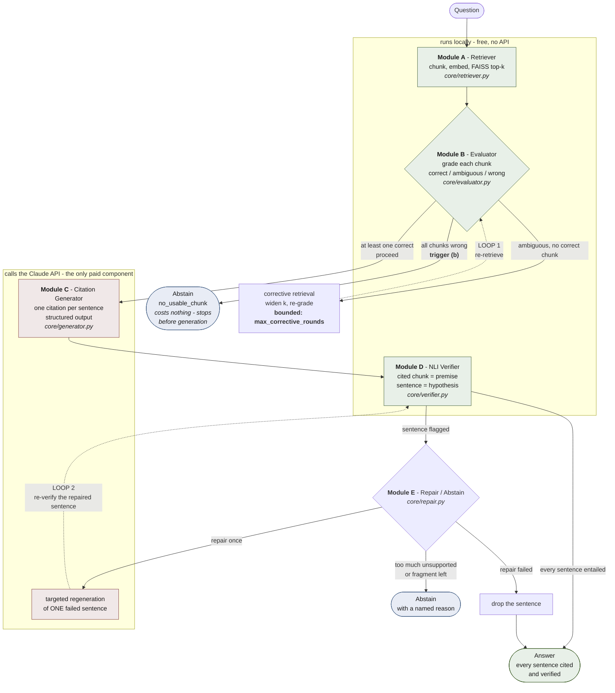

# SCRAG architecture

Five modules over one code path. Every variant in the ablation is this pipeline with later stages
switched off (`eval/variants.py`), never a forked implementation.

## The pipeline, with both corrective loops

## The two loops

**Loop 1 — bad retrieval back to Module B.** When no chunk grades `correct` but at least one grades
`ambiguous`, Module B widens the retrieval (`corrective_fetch_k`, default 15), merges the new
chunks with the old by id, and re-grades everything. **Bounded** by
`EVALUATOR.max_corrective_rounds` (default 1): an unbounded re-query on a hard question never
terminates. Measured trigger rate on answerable PopQA questions: **0.1733**.

**Loop 2 — failed verification back through Module D.** When Module D flags a sentence, Module E
regenerates *that one sentence* — not the whole answer, which would discard the verdicts the other
sentences already earned — and sends the rewrite back through Module D. A repaired sentence is kept
only if it passes on the second look. **Bounded** by `REPAIR.max_repair_attempts` (default 1): an
unbounded loop can oscillate between two equally unsupported phrasings.

## Why the local/paid split matters

Everything except generation runs on CPU with no network call: retrieval, grading, entailment
verification. This has three consequences worth stating in the report:

1. **An abstention via trigger (b) costs nothing** — the pipeline stops before the generator.
2. **Verification cost does not scale with rigour.** Checking every sentence against every citation
   is free, so there is no incentive to check less.
3. **Only one component can exhaust a budget**, which is why cost controls (prompt caching, the
   Batch API, on-disk response caching) all sit around Module C.

## Data flow types

`core/types.py` fixes the contract between modules, so each phase is a fill-in rather than a
redesign:

| Boundary | Type |
|---|---|
| A → B | `list[Chunk]` |
| B → C | `EvaluationResult` (graded chunks + `RetrievalAction`) |
| C → D | `CitedDraft` (`list[CitedSentence]`, each with `citation_ids`) |
| D → E | `VerificationReport` (`list[SentenceVerdict]`, with `per_citation` scores) |
| E → out | `FinalAnswer` (`abstained` flag + `abstain_reason`) |

**Chunk ids are the load-bearing detail.** They are `{doc_id}::{chunk_index}` so they survive
re-indexing; Module C cites them and Module D resolves them back to text. Citations are exchanged
with the model as 1-based *passage numbers* rather than raw ids, because a single wrong character
in `Ada_Lovelace::3` would read as an invented source rather than a typo.
